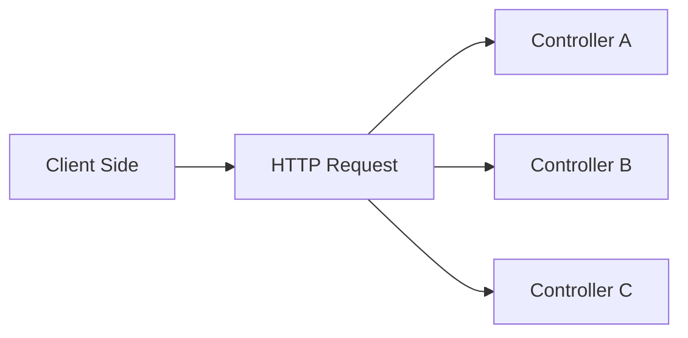

# Backend (NestJS)
The following is a summary and translation of the [official document](https://docs.nestjs.com/).

## Concept
### Controller
[official document](https://docs.nestjs.com/controllers)   

Controllers는 클라이언트에서 들어오는 요청과 내보낼 응답을 반환할 책임이 있는 Layer입니다. 기본적으로 엔드포인트를 정의하고, 여러 Provider와의 연결을 지원합니다.

### Providers
Next에서는 Controllers에서 받아온 클라이언트의 요청에 따라서 특정 로직을 수행하는데, 이 로직을 수행하기 위해서 Class를 만들어서 매핑시킵니다. 여기서 이 Class를 Providers라고 부릅니다. 이 Providers에는 서비스, 리포지토리, 팩토리, 핼퍼 등 다양한 이름으로 불리울 수 있습니다. 그리고 이 Providers에서 중요한 것은, Providers끼리 서로 다양한 관계를 형성할 수 있다는 점입니다.

Nest 뿐만아니라, 백엔드에서는 SOLID 원칙을 사용하여 개발을 하는데, 이 [SOLID](https://en.wikipedia.org/wiki/SOLID) 원칙에 대해서도 알아보겠습니다.
- 단일 책임 원칙(Single-responsibility principle): https://en.wikipedia.org/wiki/Single-responsibility_principle
  - 클래스는 단 하나의 책임을 가져야 한다.
  - 클래스가 제공하는 모든 Methods는 그 하나의 책임을 수행하는 것에 집중한다.
  - 만약, 클래스에 새로운 기능이나 책임을 추가해야한다면, 새로운 클래스를 생성해야한다.
- 개방-폐쇄 원칙(Open–closed principle): https://en.wikipedia.org/wiki/Open%E2%80%93closed_principle
  - 변경을 위한 비용은 최소화, 확장을 위한 비용은 극대화.
    - 요구사항 변경에 의해서 클래스가 수정되어야 한다면, 수정을 최소화하거나 클래스를 확장하여 새로운 클래스를 만들어야한다.
    - 확장을 위해서는 open, 수정을 위해서는 Close
- 리스코프 치환 원칙(Liskov substitution principle): https://en.wikipedia.org/wiki/Liskov_substitution_principle
  - 서브 타입은 언제나 기반 타입으로 교체 가능해야 한다.
  - 서브 타입은 언제나 기반 타입과 호환될 수 있어야 한다.
- 인터페이스 분리 원칙(Interface segregation principle): https://en.wikipedia.org/wiki/Interface_segregation_principle

- 의존성 반전 원칙(Dependency inversion principle): https://en.wikipedia.org/wiki/Dependency_inversion_principle

