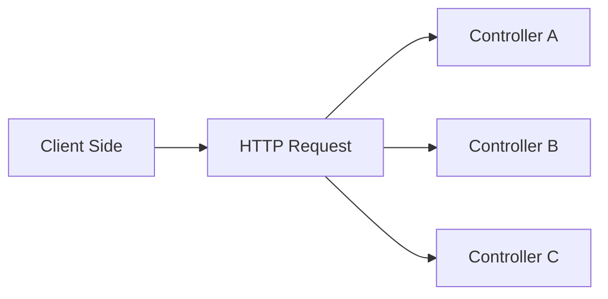

# Backend (NestJS)
The following is a summary and translation of the [official document](https://docs.nestjs.com/).

## Concept
### Controller
[official document](https://docs.nestjs.com/controllers)   

Controllers는 클라이언트에서 들어오는 요청과 내보낼 응답을 반환할 책임이 있는 Layer입니다.

<details>
  <summary>Routing</summary>
  <a href="https://docs.nestjs.com/controllers#routing">Document</a>
  <p>
    Routing은 어떤 컨트롤러가 어떤 요청을 어떻게 응답할 것인지를 제어합니다. 각 컨트롤러에는 둘 이상의 Route가 있는 경우가 많으며, Route 마다 다른 작업을 수행할 수 있습니다.
  </p>

  ```typescript
  import { Controller, Get } from '@nestjs/common';

  @Controller('cats')
  export class CatsController {
    @Get()
    findAll(): string {
      return 'This action returns all cats';
    }
  }
  ```
  위의 코드는 가장 기본적인 컨트롤러입니다. 코드를 살펴보면, `CatsController`라는 Class와 Class의 Method인 `findAll()`을 볼 수 있습니다. 그리고 `@Controller`, `@Get()`과 같은 것이 있는데 이러한 문법을 Decorator라고 합니다.   
</details>

